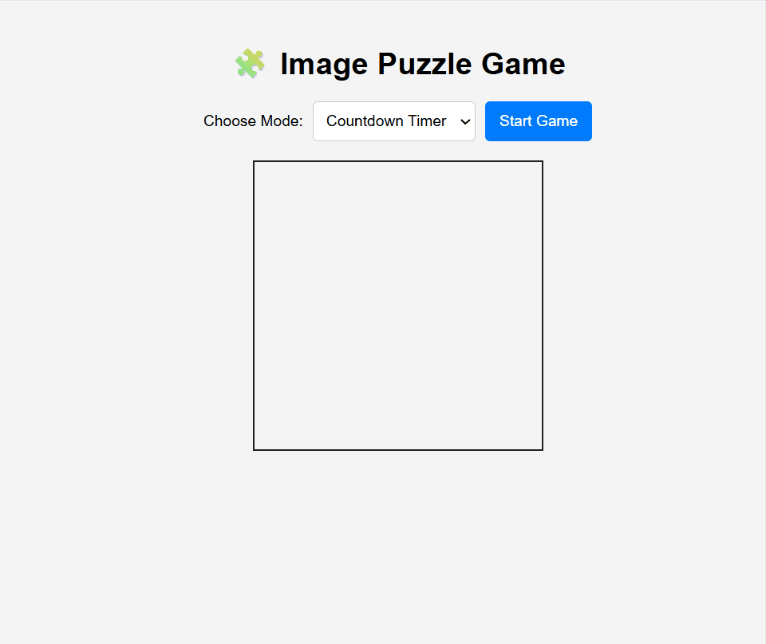

## Image Puzzle Game
A responsive, browser-based image puzzle game built with HTML5 Canvas, CSS, and JavaScript.
Test your skills by rearranging shuffled image tiles to form the correct picture!

## Live Demo
Play directly from your browser:
[Image Puzzle Game](https://rytvee.github.io/image-puzzle-app/)

## Features
- Countdown Timer Mode – Beat the clock before time runs out
- Move Counter Mode – Solve the puzzle in as few moves as possible
- Responsive Design – Works on desktop and mobile
- Custom Images – Upload your own images for a personalized challenge
- Interactive Gameplay – Drag and drop tiles to swap positions

## How to Use
- Select mode start playing
- Arrange images correctly
- Complete in time to win

## Gameplay
 

## Installation
```
git clone https://github.com/rytvee/image-puzzle-app.git
cd image-puzzle-app
```
Open `index.html` in your browser to start playing.

## License
This project is free to use and modify.
